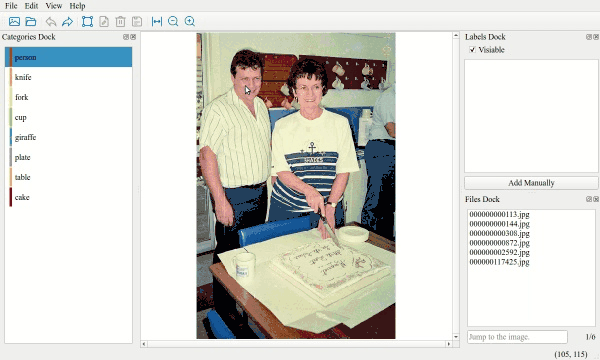

# IDAT图像目标检测标注工具



仿LabelIMG界面，优化了标注操作。


# 安装
## 方式1. pip
```shell
pip install idat

idat
```

## 方式2. 源码
```shell
git clone https://github.com/yatengLG/IDAT.git

cd IDAT

python main.py
```

# 使用
1. [菜单栏]- [设置] - 添加或修改类别
2. 左侧[类别栏]选择类别，点击[工具栏]-[创建矩形]按钮（快捷键C）
3. 分别鼠标两次点击，绘制矩形。
4. 如需要编辑，可双击矩形或右侧[标注栏]列表
